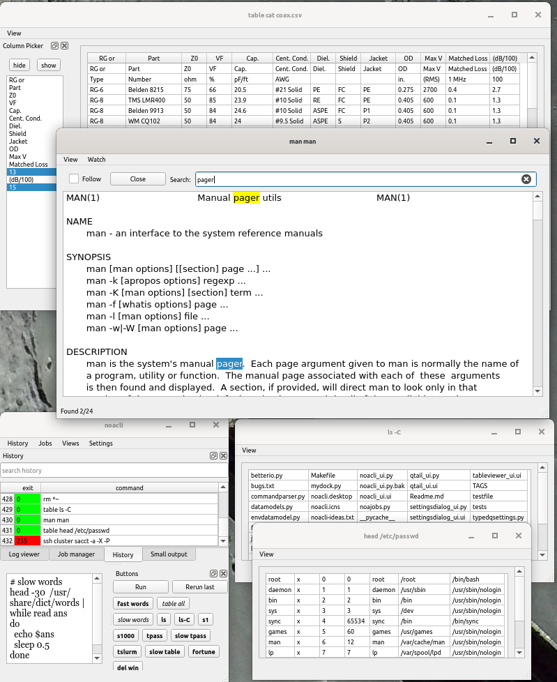

noacli: the No Ampersand CLI shell

This shell does most things regular CLI shells do (except full parsing
and Turing complete programming), but in a graphical interface.
Noacli takes full advantage of having a GUI as much as possible,
including common trivial data visualization stuff.

This readme is not comprehensive, but it hits the major points.
There's more stuff discoverable in the shell.

Dependencies
------------
This uses Python and Qt, which are dependencies.  To install these:

Mac: (pick one)
* sudo pip3 install PyQt5
* pip3 install --user PyQt5

Ubuntu:
* sudo apt install python3-pyqt5

Philosophy
----------

There are lots of (old) traditional command line shells that are quite nice.
There are a few graphical shells that are nice (like gnome-shell, KDE, etc.)
Gnome shell even has a text interface (looking glass) that is nice, but
not very convenient for every day use.

This is a hybrid shell, with both cli and graphical features.
It is not a full Turing complete parsed language, but it fully
supports using one underneath if you want that.  It doesn't even think
about being a full GUI shell with integrated window manager either, it
expects you to have one, although it can help find or close lost
windows.

The intent of this shell is to simplify a lot of cli things that make you
dedicate a terminal window to them and display their results in a more
convenient way made possible by using a full graphical interface instead
of a terminal window.

It's not that we hate background jobs, but that they seem silly when
you could have just opened another window.  It's not that we like a
proliferation of windows either -- this has measures to minimize that.

This shell tries to make the following concepts obsolete;
* terminal based text pagers
* background jobs
* waiting for jobs to complete before starting another
* terminal multiplexers
* terminal based scroll back buffers

None of these really make sense when you can just open another graphical window.

For example, instead of a command dumping a huge blob of text into a
terminal that scrolls away quickly and is lost, or piping that into a
pager, noacli will automatically put that text into a graphical window
that is sized to fit, has a scroll bar, and allows searching.  As the
program generates more output, the window will continue to collect it
and follow the end, similar to what tail -f does.

If you run another command, you get another window dedicated to it.

Structure and details
---------------------

The graphical interface includes the following items as described below:
* Pull down menus
* Command edit window
* status message bar
* "qtail" independent large scrolling output window
* Table viewer (makes up for proportional fonts and removes the need for 80 column fixed text)

The following dock windows can be rearranged, resized, and pulled off
the main window.  The view menu lets you bring back any of these if
they get lost.
* History dock window
* Job manager dock window
* Shortcut button dock
* Small output dock window
* log dock window 

The following settings dialog boxes allow editing settings:
* General settings editor
* Favorites editor
* Environment variable editor

# qtail #
The qtail window also works as a separate application from the shell,
functioning in a way similar to "tail -f" and taking a few similar
command line arguments.  As an external application, qtail will work
on files, growing files, and pipes.  It will automatically detect if a
file grows.

If qtail collects no output before the process exits, it will
automatically close.

A search box at the top of the window allows quickly finding text.
Pressing enter in the box will repeat the current search.  A counter
in the qtail status bar keeps track of repeated searches and notifies
if a search wraps to the start of the buffer.

By default, qtail starts reading a file 1M from the end, and only
remembers the most recent 10000 lines.  This is to preserve
performance and memory, but can be adjusted in settings.  Setting
either of these numbers to 0 allows infinite data kept.  (Use at your
own risk!)

Within the shell, the table command takes the `--file` and `--files` options
to indicate the following are filenames rather than a command.

# table viewer #

The table viewer takes the output from a command and tries to parse it
as a table, using several heuristics to try to guess where the columns are.
If the heuristic doesn't guess right, you can give it hints with the
following options:

 `--skip=`  
    skip lines preceding the table (default=0)

 `--delimiters=`  or `--delimiter=`  
    specify single characters that could be delimiters.  Default is comma, pipe, tab colon ('|\t,:')
    
 `--gap=`  
    Minimum number of spaces between columns if it is space delimited;
    defaults to 2 or if headers are underlined (with = or -) then 1
    
 `--columns=`  
    if the fixed width parser can't guess column boundaries, you can specify them (comma separated)
    
 `--headers=`  
    comma separated headers to use instead of the first line
    
 `--noheader`  
    use numbered headers instead of the first line
    
;`--fixed`  
:   force fixed width parsing instead of csv parsing

Like qtail, table also accepts the --file and --files options.

# small output #
The small output dock window will collect output from commands that
output a small amount of text or no text and then exit quickly.  But
if a command outputs more, or you run another command before it
finishes, it gets transferred to the large scrolling qtail window. 

If a command finishes and you run another command, normally the output
from the first is cleared, but you can check the 'keep' box if you
want to retain it for a short while (about two window fulls,
adjustable).  If you want to retain the output longer, press the dup
button to pop the output to a qtail window, whether not the process
has exited.

Programs that emit single lines and exit, or emit single lines slowly
 will also have their output sent to the status bar at the bottom of
the main window.  Also, if the small output window is not visible when
a command sends output or exits, a notification will show in the
status bar temporarily. (Delay is settable.)

# history dock #
Like traditional cli shells, this shell keeps a history of your commands.
But unlike traditional shells, you view it in a graphical dock window
that is scrollable, sortable, and can be easily filtered.

Additionally, the history keeps track if commands you typed exited
successfully, got an error, or were never run at all.  The context
menu for the history window also lets you collapse duplicate history
entries or trim the list to just unique command lines.  When duplicate
history lines are pruned, the history window keeps track of their use
frequency.  You can also right click on a history entry and choose to
save it favorites to mark it for future use.

You can also use ctrl-uparrow and ctrl-down in the command window to
browse the history.

# job manager #
The jobs you run are also tracked in a job manager dock window that
shows the critical job details and status, and helps you find or reopen lost 
windows.  Finished jobs with closed windows can be manually cleared or will
automatically clear after a timeout.

If you click on the window name in the job manager, it will raise the
window if there is one, and you can also rename the window.

Commands shown in both the job window and the history window can be
clicked on to copy them to the command edit window for further editing
or to run it again.  If you already had a partially typed command there,
it will be saved in history as a command that was never run.  Returning to
the unrun command will let you continue editing it.

# settings editor dialog #
All shell settings can be adjusted in a graphical settings edit window
that includes tooltips with default values and documentation for each
setting.  Numbers mentioned in this document are all settings and can
be changed.  An attempt has been made to make every major parameter
including timeouts and otherwise hard coded values editable settings.
Settings with default values will have a grey background and will turn
to a white background when they are edited.

# favorites and button dock #

The favorites editor, when opened, shows your previously saved
favorites, your 10 most frequently run commands, and your 10 most
recent commands not already listed.  (These numbers are settings that
can be changed of course.)  You can check or uncheck the any entry if
you want to keep it or not.  Named entries show up in the button dock
for quick access.  Also, a shortcut key binding can be set for any
favorite.  A favorite can be flagged to be immediately run when
selected, or to be inserted into the edit window as a template for
further modification.  If the command contains a marker set to {} by
default), the cursor will be placed at the marker and the marker
selected.  Also, if there was something selected in the edit window
before selecting the favorite, it will replace the marker.

When editing favorites, duplicate commands, buttons, and shortcuts are
highlighted so you can fix them.  Duplicate commands are not allowed,
and all but the first will be deleted on save.

# main command edit #
The command edit box allows typing of commands.
Commands are not restricted to a single line, but can span multiple
lines.  Multi-line commands are fed (by default) directly to bash -c
which will run the command as if it was a normal multi-line shell
script.  Since commands can be multi-line, the enter key starts a new
line.  To actually run the command, use Ctrl-Enter, or press the run
button in the button dock.

If, for some reason, you need a list of files in a command, you can
press Ctrl-F to get a normal file browser window.  You can select
multiple files there and when "opened" the filenames will be inserted
into the command.  If you open the file browser with text immediately
before the cursor, it will treat that as a starting directory.  If
there is a quote before the cursor, all the filenames chosen will be
quoted individually. The file browser is preconfigured with a number
of default file groups.  The default list is editable in settings, or
you can type a filter in the command window, select it (with keyboard
or mouse), and then press Ctrl-F to override the default this once.
If you need to select a directory instead of a file, highlight a
single `/`

If you want full pathnames instead of relative pathnames, type a * by
itself before the cursor (not selected) before activating Ctrl-F.

# Log dock window #

If you have a command that typically doesn't output anything
interesting, or all of its output is debug output (like, for instance,
a graphical program), then you can transfer its output to the log dock
(or start it there).  This window can collect output from mutliple
commands at once, and tags each line with the process ID and logs the
start and exit of jobs it is collecting from.  You can use the context
menu to manipulate the job associated with a particular log line or
clear the output from finished jobs.

Note that the log window is not designed for commands that have huge
amounts of output.  Use the qtail window for that.  By default, the
log window only remembers the last 10,000 lines from all processes it
is logging.

# Output destinations #

When commands are run, their output is sent to an initial destination.
The currently available output destinations are:

| keyword | destionation
|----|-----|
| small | output dock window
| qtail | large output browser
| log   |   dock window
| table | table parser and viewer

These output destinations are described above, but if the first word in a
command is one of the keywords (small log tail qtail) then the output
will be initially sent there, overriding any other defaults set.

Other possible special output targets may be added in the future.
Currently stdout and stderr are both sent to the same target,
but in the future, splitting them may be possible, although this
can be done now using mechanisms available in the wrapper shell.

# Wrappers #

This shell does not have the programmability of typical command line
shells and only does extremely limited parsing.  Instead, it leans on
those older shells for that functionality.

So most command lines are wrapped in a command that does the actual
parsing and execution.  This is the wrapper.  Wrappers are named,
and there is a default wrapper.  The default wrapper is named bash,
which wraps commands with [ 'bash', '-c' ].  The command itself is
fed to this wrapper unquoted and unmodified as the last argument.
Any quoting will be interpreted by the shell in the wrapper.

A wrapper can also specify the default destination for its output,
although the user can override this on a per command basis.

The following sample wrappers are included by default:

    bash : (small) [ 'bash' , '-c' ]
    xterm : (log)  [ 'xterm' , '-e' ]
    gterm : (log)  [ 'gnome-terminal', '--', 'bash', '-c']

If your $SHELL is not one of these, a wrapper will be created,
This assumes  your shell accepts '-c' to run commands on the command line.

Note that gnome-terminal needs bash's help to continue parsing the command.

It is also possible to use ssh as a wrapper, sending the command to an
external host for parsing and execution.  A wrapper for each host
would be needed.

Wrappers can be trivially created on the fly with the addwrap command.
(An editor for wrappers may be added later.)

Note that wrappers are special in that the command buffer remnant is
passed to them directly without parsing.  If, for instance, your
wrapper is 'ssh', the command is passed to ssh as a single string with
unmolested quotes, spaces, return characters, pipes, etc., in it, and
ssh will pass that to the remote shell.  This is not the case if you
used ssh without a wrapper, and your default wrapper will interpret
these before running ssh, possibly locally.

# Built in commands #

(Numbers in () in the following are a count of bash built in commands.)

Noacli does not have many built in commands, as such commands are
usually needed to support scripting (0/19) which noacli doesn't
support.  Other commands are used to adjust shell settings
(4/9). manipulate jobs (3/8) and history (2/2), and environment
settings (6/13), which noacli does mostly with a graphical interface.

Having said that, there are a few things that need commands or work best
when embedded in the command line even if there is a graphical way to do it.

The following are the built in commands noacli has (so far).
These commands must be run by themselves, not combined with other commands.

`help`  
    list all of these and their description

`version`  
    show version

`cd chdir`  
    change directories

`direct`  
    run without a wrapper using trivial parsing (space splitting only)

`addwrap`  
    add a new named wrapper

`setwrap`  
    set the default command wrapper

`type`  
    Find what things match the given command; shows both internal and
    external matches

The following builtins must be the first word of a regular command
and change the default output destination:
  
`small` (default if none specified)  
    Send output to the small output dock window

`qtail` `tail` (small output overflow or by button)  
    View possibly growing output in a scrollable browser

`log` (small output button)  
    Merge output from this and other commands into the merged log dock window

`table`  
    Attempt to parse the output as a table; designed to handle delimited
    text, fixed width tables, and large numbers of columns.

Additionally, wrappers are activated by keyword somewhat like builtin
commands and can be placed after the above output direction commands.

# Buffering #

Internally, noacli handles data in lines (which Qt calls paragraphs).
Otherwise, very little is done to control buffering, and this is
nearly completely in control of the subprocess and wrapping shell.
This is slightly complicated by noacli not using ptys (yet) to run
commands, but standard unix commands like `stdbuf` can control
buffering normally.

Except some programs (like python) completely ignore this and do their
own buffering anyway.  You can fix python by using `python -u` to run
unbuffered.  This might incur a performance penalty for large amounts
of output.  Otherwise, adding well placed flush() commands in your
code may help.

Menus
-----

The following pull down menus are also available:

The history menu shows the last 10 unique commands run.
Select one of them to re-edit it.

The job menu shows a quick status of recently run and currently
running jobs.  Select one to rase or open its window if there was one.

The view menu allows fast opening and closing of the various dock
windows.  Once visible, dock windows can be dragged, popped out,
popped back in, or closed by using their internal title bar and buttons.

The settings menu gives access to the settings dialog boxes, but also
allows you to save the window configurations by giving them a name, or
switch quickly to previously saved window configurations.

Suggested window configurations are "teeny minimal", "everything",
"output and buttons", and "default", but use your imagination to suit
your needs. If you have a default window profile, it will be loaded at
noacli start and saved at exit (unless you uncheck the DefWinProfile
setting).

Key bindings
------------

There are not many key bindings, although you can bind favorites to key bindings.

In addition to the editor key bindings used by Qt, the following keys are used:

While binding keys for favorites, binding a shortcut to Backspace will cancel it.
(This works around a bug / missing feature in Qt.)

|key         | function|
|---|---|
|Ctrl-Up     | history up (doesn't work on mac)
|Ctrl-P      | history up
|Ctrl-Down   | history down (doesn't work on mac)
|Ctrl-N      | history down
|Ctrl-Enter  | run command in the command editor
|Ctrl-Return | run command in the command editor
|Ctrl-F	     | Invoke the file browser and insert the results into the editor
|Alt-C	     | Move keyboard focus to command editor

The history keys treat history as a ring, and the position is reset when
a command is run.

In qtail:

|key         | function|
|---|---|
|Ctrl-F     | Moves keyboard focus to the find box

Odds and ends
-------------
Many items are internally documented with tooltips.
* The general settings editor shows a description of the option and
  the default value as tooltips for the two columns.
* Favorites buttons, history, and favorites display the full command as a tooltip

Built in commands are documented with the help command.

Tables windows will reset sort order and sizes when the top left
corner are clicked.  Double clicking on row and column headings will
resize the row to fit the contents if appropriate.

Clicking or double clicking on values in the table viewer copy the
contents to the clipboard.

Double clicking on the command in the history and jobs managers copies
it to the command edit window. (A partially edited command is saved to
history so it isn't lost.)

Many items have a context menu (right click) with additional actions.

Using ssh as a wrapper
----------------------
To use noacli with ssh to remote hosts, it needs to work without asking for
a password.  There are two ways to do this:

Permanent authorization
1) create a local ssh key (e.g, ssh-keygen -t rsa )
2) copy the public key to the remote host in the file authorized_keys
   (the permissions have to be exactly right for it to work, must not be
   group or world writable)
   The easiest way to do this is with ssh-copy-id
3) (optional) authorize this key with ssh-agent

Temporary authorization

On the local machine, edit ~/.ssh/config and add the following lines
  ControlMaster auto
  ControlPath ~/.ssh/socket.%h.%p.%r
As above, neither the config file nor the .ssh directory can be group or
world writable, or ssh will ignore the files.

Then when you are ready to connect, authorize to the host once with
~~~
  ssh -fnN -O 'ControlPersist 2h' user@hostname
~~~
  (adjust time to your preference)
  This command makes a nice template button if you replace hostname with {}
check the authorization with
~~~
  ssh -O check hostname
~~~  
cancel it with one of
~~~
  ssh -O stop hostname
  ssh -O exit hostname  (kills all existing connections too)
~~~

Note that the first command works well in an xterm wrapper to take
your password.

Once you have the above working, you can then add wrappers for each host with
something like
   ~~~   
   addwrap somehost ssh user@somehost.fqdn
   ~~~
