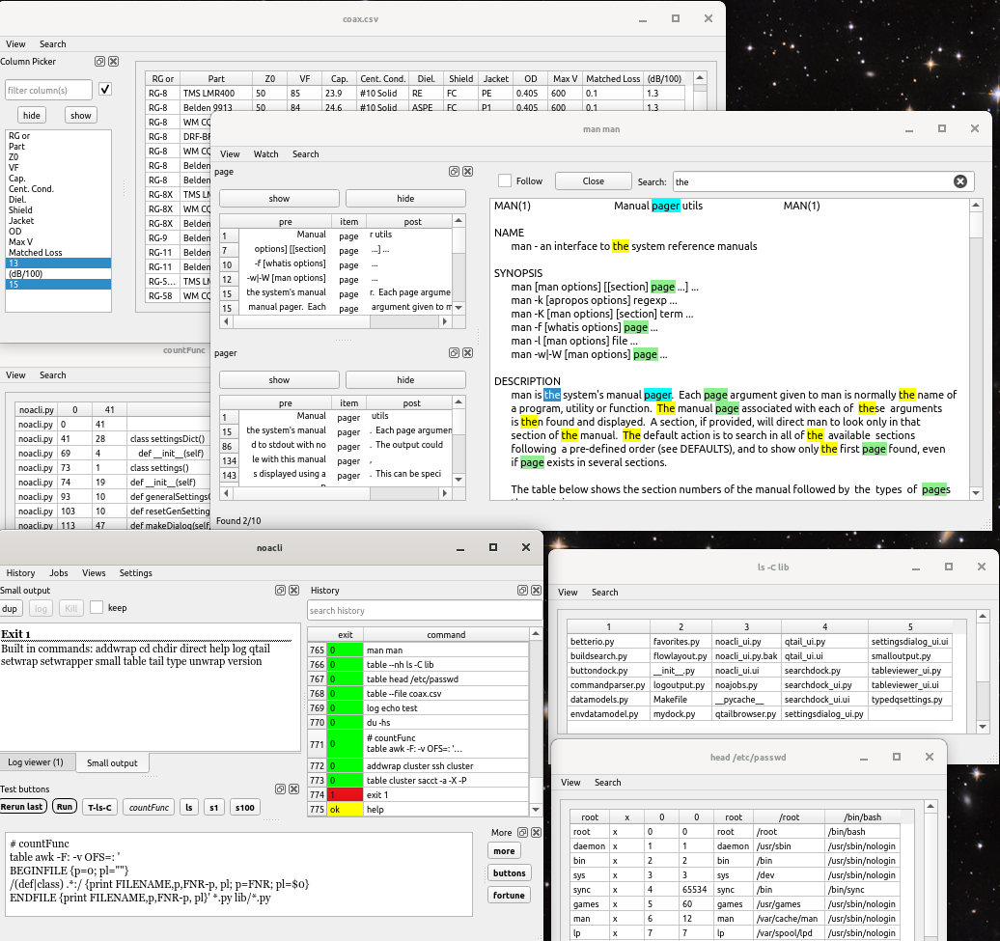
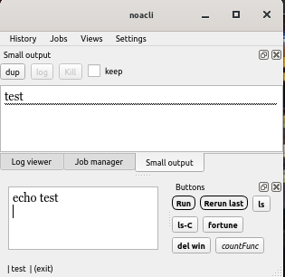

noacli: the No Ampersand CLI shell

noacli is a hybrid graphical and command line interface shell.
It tries to use the command line interface where that is most efficient,
and graphical interface elements where that can be more efficient.

This is the short description.  For a a longer list of features, see
[documentation/Readme.md](documentation/Readme.md)

This shell does most things regular CLI shells do (except full parsing
and Turing complete programming), but in a graphical interface.
Noacli takes full advantage of having a GUI as much as possible,
including common trivial data visualization stuff.

This shell tries to make the following concepts obsolete:
* terminal based text pagers
* background jobs
* waiting for jobs to complete before starting another
* terminal multiplexers
* terminal based scroll back buffers

This does not replace the standard terminal shell, but augments it and
hopefully reduces your need to ever open a second terminal, as
everything not done in the first terminal window can be done in
noacli.  You would still want a traditional terminal window for
things like:

* Full screen text applications like vi, nethack
* Text based applications expecting input from the terminal
* Other programs expecting a terminal like sudo

noacli includes three stand-alone but integrated programs:
* The main noacli shell window
* The qtail file viewer
* the tableviewer

The main shell window is a single command editor pane coupled with a
few pull down menus, some settings editors and a number of
rearrangable dock windows.

the docks are:
* The small output dock
* The history dock
* The job manager dock
* The combined log dock
* The favorites button dock

The settings editor dialog boxes are:
* General settings editor
* Favorites editor
* Environment variable editor
* Button dock editor

For a a longer list of features and details of the above features,
see [documentation/Readme.md](documentation/Readme.md)

The window is composed of docks that can be rearranged and hidden, and
various configurations saved.

