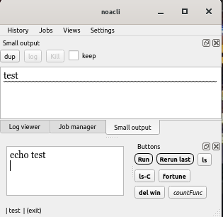
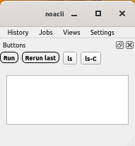

Here's a collection of screenshots of noacli...

Sorry for this cramped busy image, but I wanted to get as many of the main
features in one shot as possible.

Features to note:
* History in the history window opened the windows shown.
* The coax table has two hidden columns. (selected)
* The man page has three simultaneous searches.  The two docks show
  the context for two of them, and the third is the live incremental
  search.  The dock colors are selected from the dock context menu.
* There are two custom button docks.

The main noacli window is reconfigurable, and the configurations can be
named and saved:

...and an even more minimal configuration:

